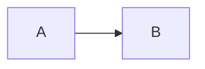

# contrib.md — Contributing to Rakam Systems Documentation (Docusaurus)

This repository contains the canonical documentation portal for **Rakam Systems** (Core AI Modules Library, SDKs, Developer Console, and Solutions), built with **Docusaurus** and deployed via GitHub Pages.

This guide is written for engineers and AI/ML practitioners who want to:
- add or update documentation
- document new modules/templates/SDK changes
- maintain the docs portal over time

> **TL;DR**
> 1) Add a Markdown file under `docs/`  
> 2) Add it to `sidebars.ts` (or ensure it is reachable via an existing category)  
> 3) Run `npm run start` locally  
> 4) Open a PR

---

## Repository links

- Source repo: https://github.com/Rakam-AI/rakam_systems
- Issues: https://github.com/Rakam-AI/rakam_systems/issues
- Create issue: https://github.com/Rakam-AI/rakam_systems/issues/new/choose

---

## Documentation architecture

### Domains (high-level structure)

Docs are separated into the following domains:

- `docs/core/` — **Core AI Modules Library**
- `docs/sdk/` — **SDK** (submodules, clients, auth, API usage)
- `docs/console/` — **Developer Console** (registry, governance, RBAC, audit)
- `docs/solutions/` — **Templates & Off-the-Shelf Solutions**
- Cross-cutting:
  - `docs/overview/` — onboarding, concepts, glossary
  - `docs/architecture/` — system architecture and diagrams
  - `docs/operations/` — deployment, environments, troubleshooting
  - `docs/security/` — security, compliance, secure development
  - `docs/release/` — versioning, lifecycle, deprecation, changelog, LTS/support
  - `docs/contributing/` — contribution and documentation guidelines

### Navigation

Sidebar navigation is defined in:

- `sidebars.ts`

If you add a new page, it must either:
1) be referenced in `sidebars.ts`, **or**
2) be linked from a page that is already referenced (depending on your navigation approach)

**Recommended:** add new pages to `sidebars.ts` so they are discoverable.

---

## Local development

### Requirements
- Node.js 20+ (recommended)
- npm 9+ (or pnpm/yarn if you standardize later)

### Install
```bash
npm install
```

### Run locally (fast preview)
```bash
npm run start
```

This starts the docs server at `http://localhost:3000`.

### Production build (link checks)
```bash
npm run build
```

The build runs broken-link checks and should succeed before merging.

---

## Docker (optional)

### Build and serve
```bash
docker build -t rakam-systems-docs:latest .
docker run --rm -p 8080:8080 rakam-systems-docs:latest
```

Open: `http://localhost:8080`

---

## Writing standards

### 1) File naming
- Use kebab-case: `my-new-module.md`
- Keep file names stable to avoid breaking deep links.

### 2) Page frontmatter
Each page should begin with frontmatter:
```md
---
title: My Page Title
---
```

Optional fields:
- `description: ...`
- `sidebar_position: N` (if you adopt auto-generated sidebars later)
- `tags: [tag1, tag2]` (if you add tags support)

### 3) Structure (recommended)
Use a consistent structure:

- What it is / when to use
- Concepts / architecture
- How to use (tutorial)
- API/CLI reference (if applicable)
- Configuration
- Observability
- Security considerations
- Compatibility / versioning notes
- Troubleshooting
- Related links

### 4) Tone
- Short paragraphs
- Prefer examples over prose
- Avoid ambiguous words (“it might”, “sometimes”) unless necessary
- Include constraints and edge cases

### 5) Code examples
- Keep examples minimal and copy/pasteable
- Prefer realistic values and placeholders:
  - `YOUR_API_KEY`, `YOUR_WORKSPACE_ID`, `MODULE_ID`
- Specify language fences:
```bash
curl ...
```

### 6) Diagrams (Mermaid)
Use Mermaid for architecture diagrams:
```md

```

---

## Adding documentation for a new AI module (step-by-step)

When an AI engineer adds a new module to the Core Library, they must also add documentation.

### Step 1 — Create a module doc page

Create a file:

- `docs/core/modules/<module-id>.md`

If `docs/core/modules/` does not exist, create it and add an index file.

**Template you can copy:**
```md
---
title: <Module Name>
description: One-line description of what this module does.
---

## Overview
What the module does and when to use it.

## Inputs
Describe input schema (include types, required/optional, defaults).

## Outputs
Describe output schema.

## Configuration
List configuration parameters.

## Usage examples
### Python
```python
from aimodules_sdk import Client

client = Client(api_key="YOUR_API_KEY")
result = client.modules.run("MODULE_ID", inputs={...})
print(result)
```

### TypeScript
```ts
import { Client } from "@aimodules/sdk";

const client = new Client({ apiKey: process.env.AI_KEY! });
const result = await client.modules.run("MODULE_ID", { inputs: { /* ... */ } });
console.log(result);
```

## Runtime requirements
CPU/GPU, memory, latency expectations, concurrency model.

## Observability
Logs, metrics, traces, evaluation signals.

## Security considerations
Data handling, PII, secrets, prompt injection defenses (if relevant).

## Compatibility
- Module version: `MAJOR.MINOR.PATCH`
- Supported platform/runtime versions
- Supported SDK version ranges

## Troubleshooting
Common errors and remediation steps.
```

### Step 2 — Add the module to the sidebar

Edit `sidebars.ts` and add your module page under **Core AI Modules Library**.

Example:

```ts
{
  type: "category",
  label: "Core AI Modules Library",
  link: { type: "doc", id: "core/index" },
  items: [
    "core/modules",
    "core/pipelines",
    // Add module docs here:
    "core/modules/<module-id>"
  ]
}
```

> If you expect many modules, consider creating a category index:
> - `docs/core/modules/index.md`
> - and a sidebar category that contains module pages.

### Step 3 — Add cross-links
Update at least one “index” page:
- `docs/core/modules.md` (or `docs/core/index.md`)
Include a short table with module links and “when to use”.

### Step 4 — Validate locally
Run:
```bash
npm run start
npm run build
```

Fix:
- broken links
- missing frontmatter titles
- formatting problems

### Step 5 — Open a PR
Include:
- module docs page
- sidebar update
- any diagrams/images required
- versioning/compatibility notes

---

## Adding or updating SDK documentation

SDK docs live under `docs/sdk/`.

When you change SDK behavior:
1) Update the relevant topic (auth/clients/apis)
2) Add a short entry to the **artifact changelog** (if your release process uses one)
3) Ensure compatibility rules are respected:
   - Breaking changes only in MAJOR
   - Additive changes in MINOR
   - Bugfixes in PATCH

If you are adding a new SDK submodule, add:
- a new page under `docs/sdk/`
- a new entry in `sidebars.ts`

---

## Adding Templates / Solutions docs

Templates & Solutions live under `docs/solutions/`.

Each template should have:
- overview
- configuration matrix
- deployment steps
- supported platform/module versions
- upgrade/migration notes

Recommended naming:
- `docs/solutions/templates/<template-id>.md`

---

## Images and static assets

Place assets in:
- `static/img/`

Reference them in Markdown:
```md

```

Guidelines:
- Use SVG for diagrams when possible
- Keep images lightweight
- Avoid embedding secrets in screenshots

---

## Link policy (broken links)

The build fails on broken links. Before pushing, run:

```bash
npm run build
```

If you truly need to link to a future page, do **one** of:
- create a stub page now
- link to an external issue/PR tracking the work

Do **not** disable broken link checks unless absolutely necessary.

---

## Versioning of documentation

This portal supports **Docusaurus versioning**.

### When to version docs
Create a docs version when you release a new platform/SDK major or minor that introduces:
- breaking API changes
- important behavior changes
- significant UI changes in the console
- changes to module interfaces

### Create a new docs version
```bash
npm run version:current -- vX.Y.Z
```

This will create:
- `versioned_docs/`
- `versioned_sidebars/`
- `versions.json`

### Editing older versions
To patch a prior version’s docs, edit files under:
- `versioned_docs/version-vX.Y.Z/`

Prefer to keep old versions stable and only backport critical corrections.

---

## PR checklist

Before requesting review:

- [ ] New pages have frontmatter `title`
- [ ] `sidebars.ts` updated (or the page is reachable)
- [ ] `npm run build` succeeds
- [ ] No broken links
- [ ] Examples compile / are plausible
- [ ] Security-sensitive guidance reviewed (if relevant)
- [ ] Versioning/compatibility notes added for module/SDK changes
- [ ] Screenshots/assets added to `static/img/` and referenced correctly

---

## Review process

- Small doc changes: 1 reviewer
- API contract / security / compliance docs: 2 reviewers (one domain owner)
- Release policy docs: maintainers only

If you’re unsure who owns a section, open an issue first:
https://github.com/Rakam-AI/rakam_systems/issues/new/choose

---

## Maintenance responsibilities

Maintainers should periodically:
- check for stale docs (especially SDK and console UI)
- keep Release & Maintenance policies accurate
- ensure new modules/templates have documentation before release
- validate that versioned docs still build

Suggested cadence:
- monthly: broken links, navigation audit
- per release: update changelog/release notes and versioned docs

---

## Troubleshooting

### “Broken links” error
Most common cause: sidebar/nav links point to a page that doesn’t exist.  
Run `npm run build` and use the output to locate the source page.

### “Last update requires git”
If building inside Docker, git metadata may not exist. This warning is safe.  
If you want accurate last-updated info in Docker builds, ensure `.git` is present in the build context.

### GitHub Pages baseUrl
GitHub Pages project sites require:
- baseUrl = `/rakam_systems/`

Docker/local builds typically use:
- baseUrl = `/`

This project supports both through environment variables:
- `DOCS_BASEURL`
- `DOCS_URL`

See `README.md` for examples.

---

## License and attribution
- Do not add assets you do not have rights to use.
- Prefer self-created SVGs or appropriately licensed images with attribution.

---

*Last updated: 2026-01-29*
